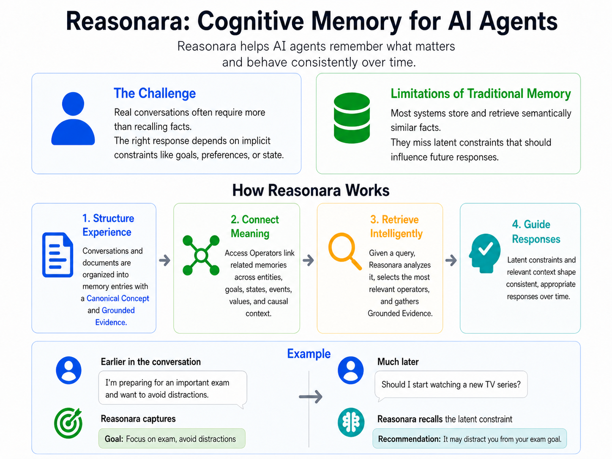

# Reasonara: Cognitive Memory for AI Agents

Reasonara is a cognitive memory system for long-horizon AI agents. It helps agents remember what matters—not only explicit facts, but also the latent goals, states, preferences, values, and causal constraints that should guide future behavior.

Traditional memory systems retrieve semantically similar fragments. Reasonara goes further: it turns experience into structured memory, links meaning across time, retrieves by cognitive relevance, and uses grounded evidence to keep responses consistent with the user’s broader context.

## How Reasonara Works

Reasonara organizes conversations and documents into memory entries with two core parts: a **Canonical Concept**, which provides a stable semantic anchor, and **Grounded Evidence**, which preserves the concrete details needed for reasoning and verification.

The system then connects those memories through **Access Operators** and **Cognitive Operators** over entities, goals, states, events, values, causes, contradictions, and consequences. At query time, Reasonara does not merely ask “what looks similar?” It asks “what hidden constraint should shape this response?”

This lets an agent recall that a user preparing for an important exam wants to avoid distractions, then later use that latent constraint when the user asks whether to start a new TV series.

## Benchmark Results

### LoCoMo Long-Term Memory

LLM-as-judge scores across LoCoMo question types. Higher is better.

| Method | Multi-hop | Temporal | Open-domain | Single-hop | Overall |
|---|---:|---:|---:|---:|---:|
| Full Context | 0.766 | 0.819 | 0.500 | 0.885 | 0.825 |
| RAG | 0.557 | 0.548 | 0.458 | 0.710 | 0.633 |
| Zep* | 0.537 | 0.602 | 0.438 | 0.669 | 0.616 |
| Mem0 | 0.624 | 0.660 | 0.500 | 0.677 | 0.653 |
| LangMem* | 0.710 | 0.508 | 0.590 | 0.845 | 0.734 |
| Nemori* | 0.751 | 0.776 | 0.510 | 0.849 | 0.794 |
| Memora | 0.787 | 0.866 | 0.594 | 0.918 | 0.863 |
| Reasonara (GPT-5.4-mini) | 0.938 | 0.860 | 0.719 | 0.883 | 0.898 |
| Reasonara (GPT-5.4) | **0.967** | **0.907** | **0.781** | **0.908** | **0.933** |

Results for Zep, LangMem and Nemori are reported from [Nan et al. (2025)](https://arxiv.org/html/2508.03341v1)

### LoCoMo-Plus Cognitive Memory

LLM-as-judge scores using `gpt-4o-mini` as the judge model. Higher is better.

| Method | Score |
|---|---:|
| gpt-5-nano | 14.84 |
| SeCom | 14.90 |
| Mem0 | 15.80 |
| A-Mem | 17.20 |
| gpt-4.1 | 18.63 |
| gpt-4o | 21.05 |
| gemini-2.5-flash | 24.67 |
| gemini-2.5-pro | 26.06 |
| Reasonara (gpt-5.4-mini) | 62.34 |
| Reasonara (gpt-5.4) | **72.82** |

## Key Takeaway

Reasonara improves both factual long-term memory and cognitive memory. On LoCoMo, it reaches the best overall LLM-as-judge score of **0.933**. On LoCoMo-Plus, it separates sharply from conventional memory systems and foundation-model-only baselines, reaching **72.82** versus **26.06** for the strongest non-Reasonara baseline.
